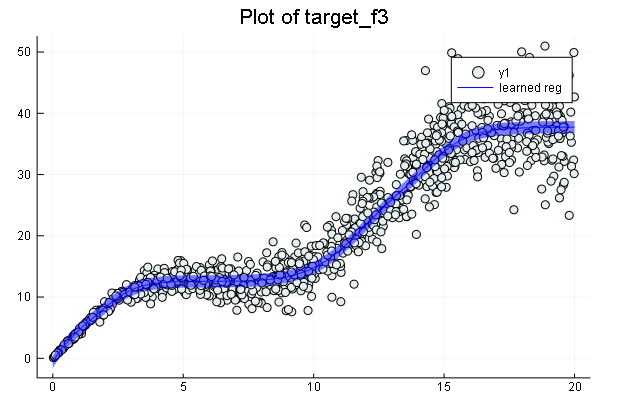
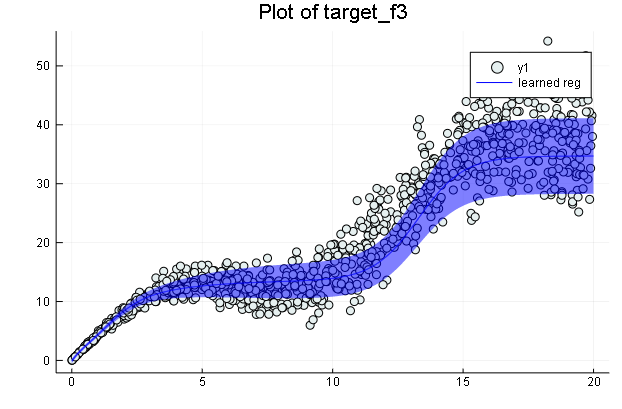

# Julia-Neural-Network-with-Nonlinear-Regression-and-heteroscedastic-noise
This project experiments with fitting linear and non-linear regression models with heteroscedastic noise using multi-layer neural networks and MLE to capture both the mean and variance.

## Implementations include:
* **`Julia-Neural-Network-with-Nonlinear-Regression-and-heteroscedastic-noise.ipynb`** the final jupyter notebook project.
